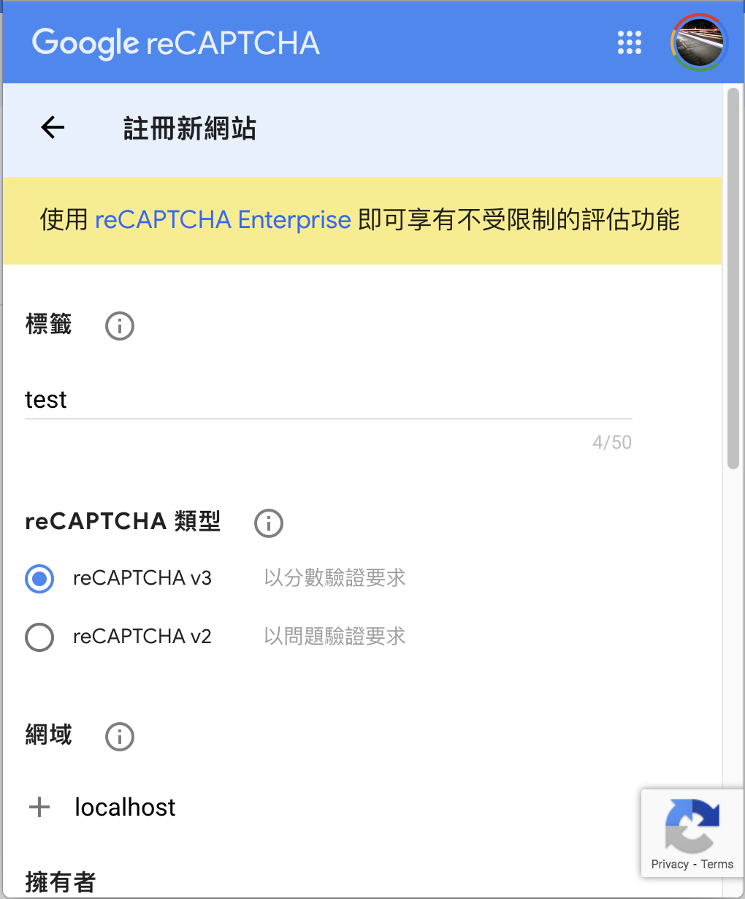
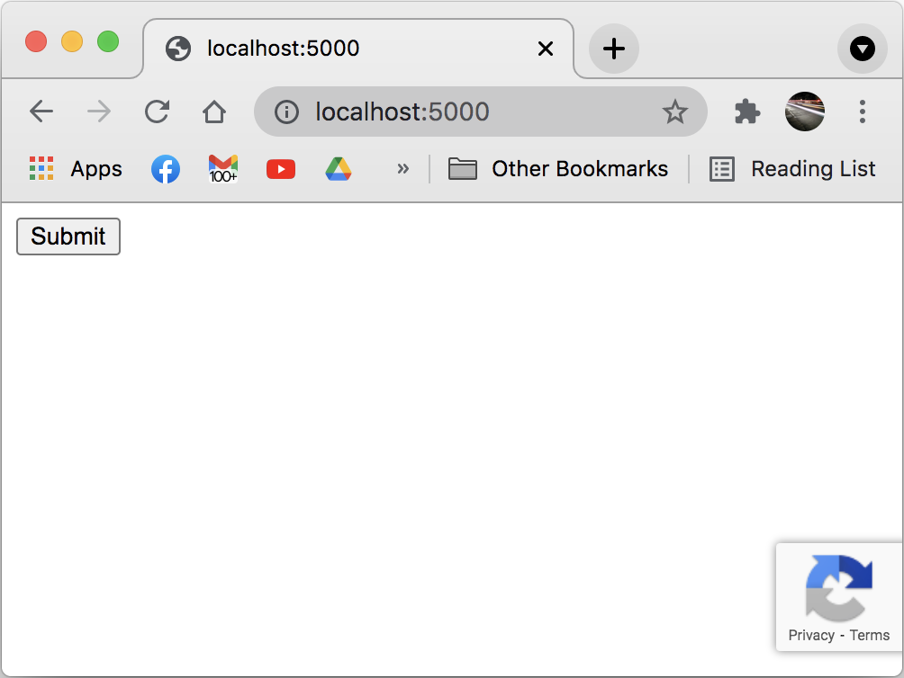
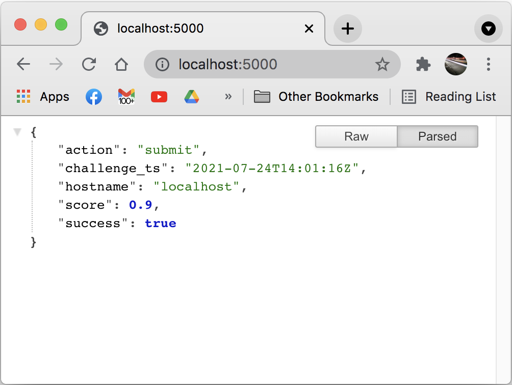
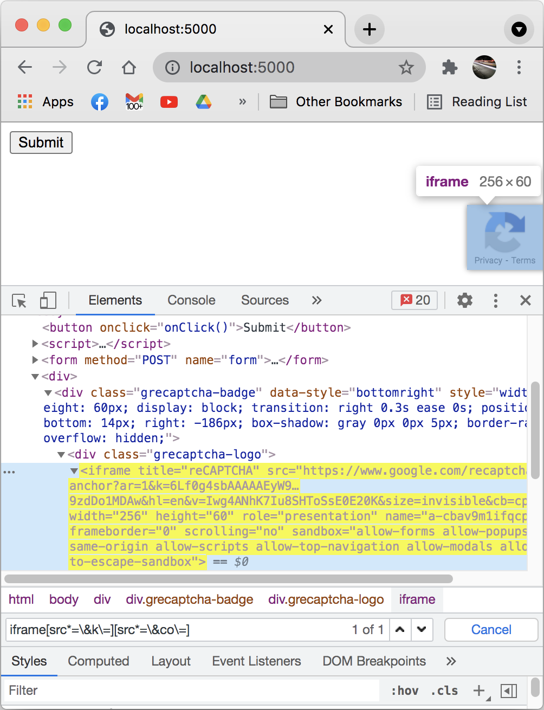
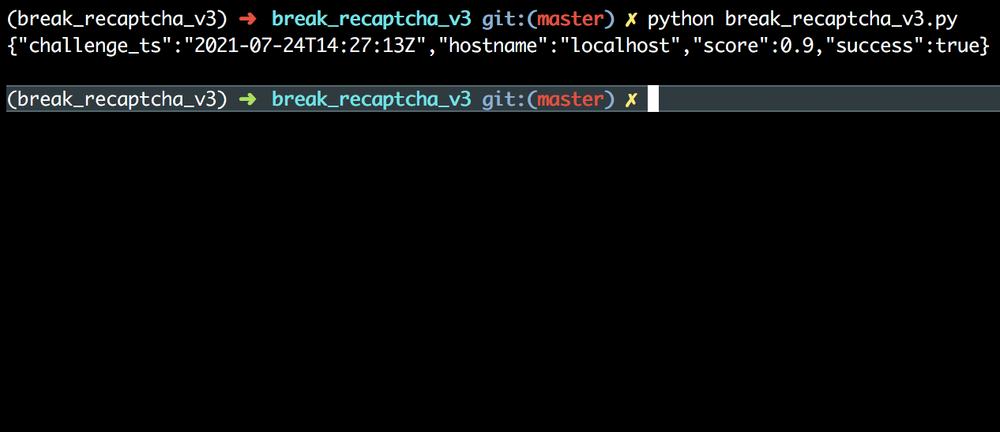

對於有做過自動化收集資料(爬蟲)的工程師來說，應該都遇過 Google reCAPTCHA ，這次不用 selenium 或 puppeteer 這些沒效率的模擬瀏覽器工具，直接使用 requests 解決 reCAPTCHA v3 驗證。

本次介紹使用的版本為 python 3.7.3，共分兩部分，第一是 reCAPTCHA v3 的網站設定，當作測試網站，第二是驗證 reCAPTCHA v3 ，使用 break\_recaptcha\_v3.py 自動化驗證 reCAPTCHA v3。 ((本次範例只能解決簡單的v3，至於更進階的通用解，等有空再開新的repo介紹

- [架設 reCAPTCHE v3 網站](架設 reCAPTCHA v3 網站)
- [驗證 reCAPTCHA v3](驗證 reCAPTCHA v3)

## 架設 reCAPTCHA v3 網站

[註冊](https://g.co/recaptcha/v3)流程如下圖，選擇v3，網域要輸入你想保護的網站，像是 example.com 。

<strong>這邊輸入 localhost 是方便本地端測試，實際使用時不能用 localhost</strong>

送出之後會給你<strong>網站金鑰</strong>以及<strong>密鑰</strong>，就是 config/app\_config.py 裡的 `site_key` 跟 `secret_key`

reCAPTCHA v3 的 [設定](https://developers.google.com/recaptcha/docs/v3) 及 [驗證](https://developers.google.com/recaptcha/docs/verify) 方式，在文件裡面講得很清楚，就不贅述。

將剛取得的`site_key`跟`secret_key `寫到 config/app\_config.py ，執行範例 `python app.py` 後開啟 `http://localhost:5000/` 就可以得到下方的結果。

## 驗證 reCAPTCHA v3
break\_recaptcha\_v3.py 示範如何使用一般的 requests 取得有效的 recaptcha v3 的 token 。

#### 第一步
要先取得 site key 跟 co 兩個參數，這兩個參數在同一個網域下，基本上是固定不變。

連線到有使用v3的目標網站，根據下圖可以發現它們在iframe的src裡，大概會有這樣的格式 (<b>k值就是site key</b>) `https://www.google.com/recaptcha/api2/anchor?ar=1&k=...&co=...&hl=en&v=...&size=invisible&cb=...`。

#### 第二步
將 site key 跟 co 寫到 break\_recaptcha\_v3.py ，執行 `python break_recaptcha_v3.py`

